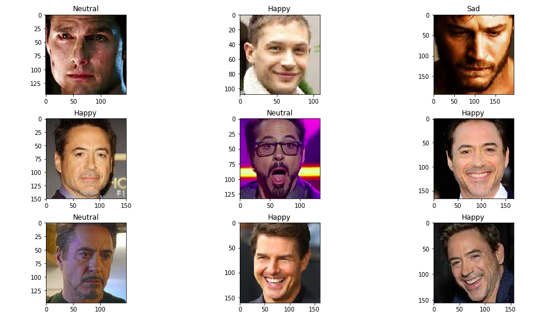

# CNN-Facial expression recognition
A CNN facial expression recognition system made using keras.
Facialexpressionusingcamera file uses the the model trained on the dataset and directly predicts the emotion of the face on the frame.

## Classes in the dataset:
1. Happy
2. Sad
3. Neutral
4. Surprised

## Summary of Model:
Model: "sequential1"

| Layer (type)               |  Output Shape       |  Parameters    |
| :-------------------------:| :-----------------: | :------------: |
| conv2d8 (Conv2D)           | (None, 48, 48, 32)  |       320      | 
| activation11 (Activation)  | (None, 48, 48, 32)  |       0        | 
| batchnormalization10       | (None, 48, 48, 32)  |      128       |
| conv2d9 (Conv2D)           | (None, 48, 48, 32)  |       9248     | 
| activation12 (Activation)  | (None, 48, 48, 32)  |       0        | 
| batchnormalization11       | (None, 48, 48, 32)  |      128       |
| maxpooling2d4(MaxPooling2) | (None, 24, 24, 32)  |      0         |
| dropout6 (Dropout)         | (None, 24, 24, 32)  |       0        | 
| conv2d10 (Conv2D)          | (None, 24, 24, 64)  |       18496    | 
| activation13 (Activation)  | (None, 24, 24, 64)  |       0        | 
| batchnormalization12       | (None, 24, 24, 64)  |      256       |
| conv2d11 (Conv2D)          | (None, 24, 24, 64)  |       36928    | 
| activation14 (Activation)  | (None, 24, 24, 64)  |       0        | 
| batchnormalization13       | (None, 24, 24, 64)  |      256       |
| maxpooling2d5(MaxPooling2) | (None, 12, 12, 64)  |      0         |
| dropout7 (Dropout)         | (None, 12, 12, 64)  |       0        | 
| conv2d12 (Conv2D)          | (None, 12, 12, 128) |       73856    | 
| activation15 (Activation)  | (None, 12, 12, 128) |       0        | 
| batchnormalization14       | (None, 12, 12, 128) |      512       |
| conv2d13 (Conv2D)          | (None, 12, 12, 128) |       147584   | 
| activation16 (Activation)  | (None, 12, 12, 128) |       0        | 
| batchnormalization15       | (None, 12, 12, 128) |      512       |
| maxpooling2d6(MaxPooling2) | (None, 6, 6, 128)   |      0         |
| dropout8 (Dropout)         | (None, 6, 6, 128)   |       0        | 
| conv2d14 (Conv2D)          | (None, 6, 6, 256)   |       295168   | 
| activation17 (Activation)  | (None, 6, 6, 256)   |       0        | 
| batchnormalization16       | (None, 6, 6, 256)   |      1024      |
| conv2d15 (Conv2D)          | (None, 6, 6, 256)   |       590080   | 
| activation18 (Activation)  | (None, 6, 6, 256)   |       0        | 
| batchnormalization17       | (None, 6, 6, 256)   |      1024      |
| maxpooling2d7 (MaxPooling2 | (None, 3, 3, 256)   |      0         |
| dropout9 (Dropout)         | (None, 3, 3, 256)   |       0        | 
| flatten1 (Flatten)         | (None, 2304)        |       0        | 
| dense3 (Dense)             | (None, 64)          |       147520   | 
| activation19 (Activation)  | (None, 64)          |       0        | 
| batchnormalization18       | (None, 64)          |      256       |
| dropout10 (Dropout)        | (None, 64)          |       0        | 
| dense4 (Dense)             | (None, 64)          |       4160     | 
| activation20 (Activation)  | (None, 64)          |       0        | 
| batchnormalization19       | (None, 64)          |      256       |
| dropout11 (Dropout)        | (None, 64)          |       0        | 
| dense5 (Dense)             | (None, 7)           |       455      | 
| activation21 (Activation)  | (None, 7)           |       0        | 
| dense6 (Dense)             | (None, 4)           |       32       | 
| activation22 (Activation)  | (None, 4)           |       0        |

Total params: 1,328,199
Trainable params: 1,326,023
Non-trainable params: 2,176

## Accuracy of model:
### 0.5744

## Test Output:
